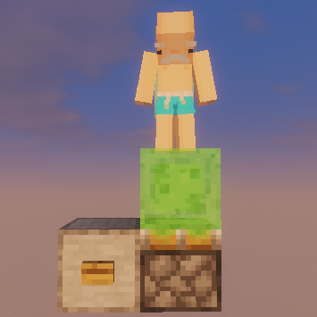

[English](README.md)

# Piston Bounce Fix

一个用于 Minecraft 26.3 的服务端 Fabric 模组，修复活塞无法将站在史莱姆方块上的玩家弹起的原版 Bug。

## 修复内容

在 Minecraft 26.3 中，玩家站在被活塞推动的史莱姆方块上时不会被弹起，玩家会留在方块上而不是被弹飞。

该 Bug 只在多人服务器上出现，并且网络延迟越高越容易触发。单人游戏不受影响。

## 运行要求

- Minecraft 26.3
- Fabric Loader 0.19.5 或更高版本
- Fabric API

## 安装

服务端：

1. 下载 `piston-bounce-fix` 模组 jar。
2. 将其放入服务端的 `mods` 文件夹。
3. 重启服务端。

客户端：

无需安装。本模组仅在服务端运行，玩家使用原版或 Fabric 客户端即可正常进入服务器。